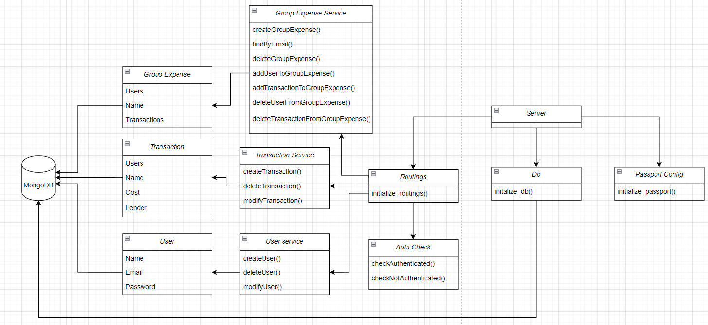
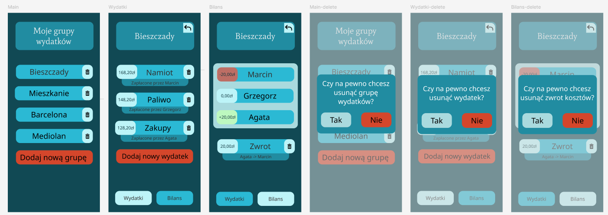

*Aplikacja internetowa do zarządzania grupowymi wydatkami*

1. Cel projektu

Aplikacja ma na celu ułatwienie zarządzania grupowymi wydatkami, a także ich rozliczanie między uczestnikami. 
Produkt skierowany jest do szerokiego grona odbiorców, w tym rodzin, grup znajomych, współlokatorów oraz zespołów pracowniczych. 
Główne cele to uproszczenie procesu śledzenia wydatków, automatyzacja rozliczeń oraz zapewnienie przejrzystości finansowej w grupach.

2. Funkcjonalności

* Dodawanie grup wydatków: możliwość utworzenia grupy wydatków i dodanie do niej członków 
* Dodawanie transakcji: możliwość wprowadzenia transakcji określając nazwę, kwotę, biorących w niej udział członków oraz tego, kto ją opłacił
* Automatyczne obliczanie rozliczeń: algorytm obliczający kto komu ile jest winien

3. Użyte technologie

Backend:
* Node.js
* Express
* MongoDB
* Mongoose
* Passport
* bcryptjs
* dotenv

Frontend:
* HTML
* CSS
* JavaScript

4. Jak uruchomić projekt

Aby uruchomić projekt, należy utworzyć plik .env i uzupełnić następujące zmienne:

```
PORT=
MONGODB_URI=
SESSION_SECRET=
```

A następnie użyć komendy:

```
npm run devStart 
```

5. Diagram UML



6. Wireframe

